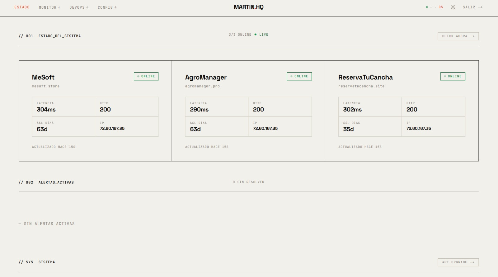
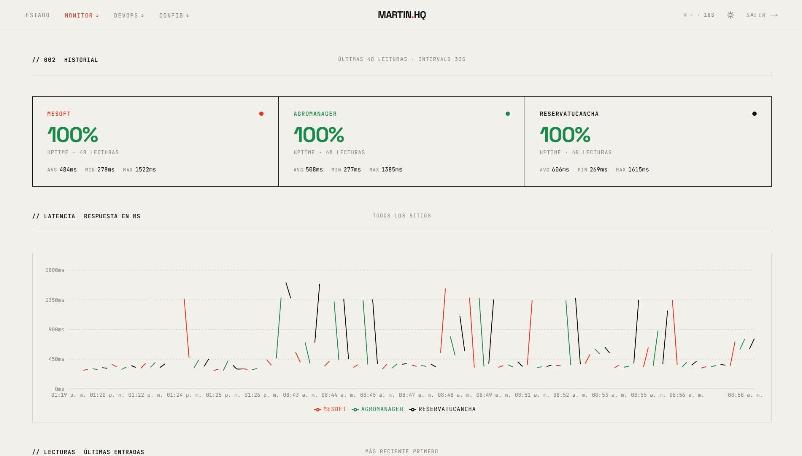
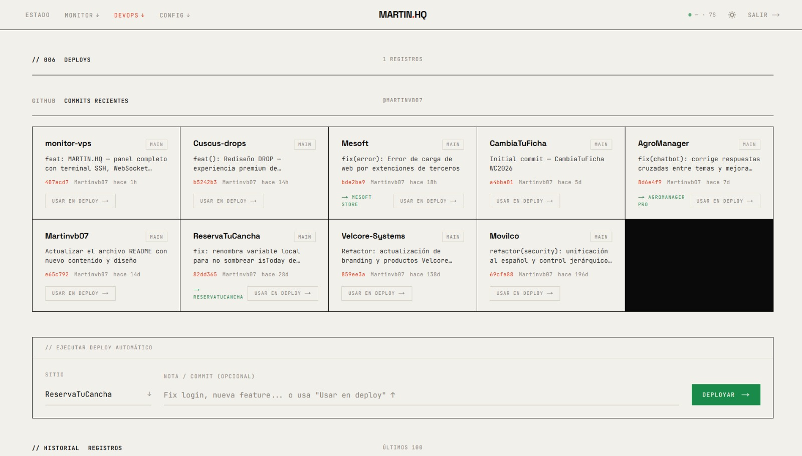
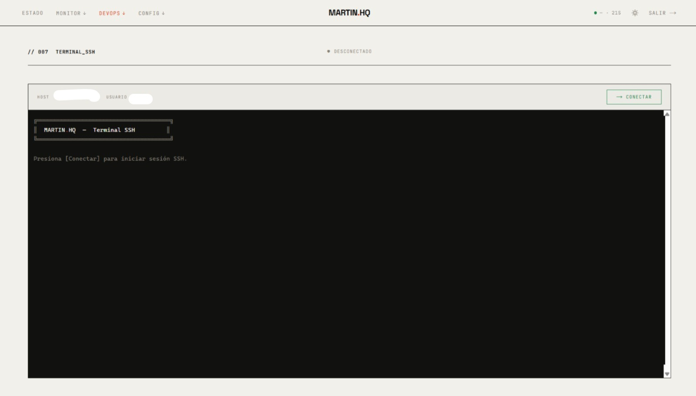

<div align="center">


# MARTIN.HQ — Monitor

**Panel de monitoreo en tiempo real para VPS, sitios web y procesos, con terminal SSH integrada**

*Controlá tu infraestructura desde cualquier dispositivo, en cualquier momento*

---

[](https://nextjs.org/)
[](https://nodejs.org/)
[](https://www.typescriptlang.org/)
[](https://developer.mozilla.org/en-US/docs/Web/API/WebSockets_API)
[](https://web.dev/progressive-web-apps/)

</div>

---

## Capturas

<div align="center">



*// 001 ESTADO_DEL_SISTEMA — chequeo en tiempo real con latencia, HTTP, SSL y IP*

<br/>



*// 002 HISTORIAL — uptime 100% y gráfica de latencia de las últimas 48 lecturas*

<br/>



*// 006 DEPLOYS — commits recientes de GitHub con deploy en un click*

<br/>



*// 007 TERMINAL_SSH — terminal completa en el browser vía WebSocket + xterm.js*

</div>

---

## ¿Qué es MARTIN.HQ?

**MARTIN.HQ** es un dashboard de monitoreo personal diseñado para tener visibilidad total sobre un servidor VPS y los sitios web que corre, directamente desde el browser — sin depender de herramientas externas ni servicios de terceros.

Todo corre en tu propio servidor. Tus datos no salen de tu infraestructura.

El sistema verifica automáticamente cada 30 segundos el estado de tus sitios y envía actualizaciones en tiempo real al dashboard vía WebSocket. Si algo cae, el panel lo muestra al instante — sin necesidad de recargar la página.

---

## ¿Qué podés hacer con MARTIN.HQ?

### 📡 Monitoreo de sitios web
Seguimiento continuo de cada sitio con chequeo automático cada 30 segundos:
- **Estado** — Online / Down con dot animado en tiempo real
- **Latencia HTTP** — En milisegundos, alertas a >800ms y >2000ms
- **Código HTTP** — Status code de la respuesta
- **SSL** — Días restantes, alertas automáticas a los 30 y 14 días
- **IP** — Dirección IP resuelta vía DNS
- Grid dinámico: 4 sitios → 2×2, 3 sitios → 3 columnas

### 📊 CPU / RAM / Disco en tiempo real
Widget de recursos del servidor integrado en el dashboard principal:
- CPU % basado en load average
- RAM usada / total en MB
- Disco / (raíz) usado / total
- Uptime del servidor
- Actualización automática cada 10 segundos

### 🔴 Sistema de alertas
Alertas automáticas con auto-resolución:
- Filtros por estado y severidad (crítica / warning)
- Historial de las últimas 200 alertas
- Resolución manual con toast de confirmación
- Push notifications al celu cuando un sitio cae (PWA)
- Badge en el favicon con contador de alertas activas

### 📈 Historial y uptime
- Vista **48h** — gráfica de latencia por sitio, stats avg/min/max
- Vista **30 días** — gráfica de barras de uptime diario, tabla por fecha
- Toggle entre vistas desde el mismo panel
- Sitios dinámicos (no hardcodeados)

### 💻 Terminal SSH multi-servidor
Terminal SSH completamente funcional en el browser, con **xterm.js**:
- Selector de servidor — conectá a cualquier VPS configurado
- Conexión vía WebSocket con token firmado (HMAC)
- Soporte completo de colores ANSI y caracteres especiales
- **Ctrl+Alt+C** para copiar, **Ctrl+Alt+V** para pegar, clic derecho = pegar
- `copyOnSelect: true` — seleccionar texto lo copia automáticamente
- Resize dinámico, sesiones protegidas por JWT

### 🖥️ Multi-servidor
Soporte para múltiples VPS desde un solo panel:
- Configuración vía variables de entorno (`SERVER_1_*`, `SERVER_2_*`, ...)
- Métricas SSH (CPU/RAM/disco) de cada servidor remoto
- PM2 list + restart por servidor
- Leer/escribir archivos en cualquier servidor vía SSH
- Selector en terminal, env editor y nginx editor

### 🚀 Deploys y GitHub integration
- Scripts de deploy dinámicos — detecta automáticamente `/root/deploy_<sitio>.sh`
- Modal editor para crear/editar scripts directamente desde el panel (guarda en VPS con `chmod +x`)
- Output en tiempo real del script de deploy
- Integración con **GitHub API** — últimos commits de todos tus repos
- Un click en "Usar en deploy" pre-rellena el formulario
- Historial de los últimos 100 deploys

### ⚙️ Procesos PM2
- CPU, RAM, reinicios y estado de cada proceso
- Restart con confirmación via toast
- Alertas cuando CPU > 80% o reinicios > 5

### 📝 Editor de variables de entorno
- Escanea `/var/www` (o dirs configuradas) vía SSH y lista todos los `.env`
- Editor inline con backup automático (`.bak`) antes de guardar
- Selector de servidor — editá `.env` de cualquier VPS
- Muestra ruta completa y proyecto de cada archivo

### 🌐 Nginx Editor
- Lista configs de `sites-available` con estado ON/OFF
- Editor con syntax highlight, botón `nginx -t` y reload
- Toggle enable/disable de sitios con symlink automático
- Backup `.bak` antes de cada guardado
- Funciona en cualquier servidor vía SSH

### 📋 Notas
- **// 001 Markdown Editor** — editor con preview en vivo lado a lado (split view)
- **// 002 Notas rápidas** — cards con efecto archivador, modal editor con tabs Editor/Split/Preview
- Checkboxes funcionales en modo preview (`- [ ]` / `- [x]`)
- Auto-guardado a los 800ms, múltiples notas independientes

### 🌐 Visitantes y analytics
- Requests del día, IPs únicas, bots detectados, errores 4xx/5xx
- Distribución horaria del tráfico
- Feed en vivo de las últimas peticiones
- Países de origen y referrers

### 🛡️ Seguridad
- IPs bloqueadas con motivo y cantidad de intentos
- Verificación de headers de seguridad por sitio (HTTPS, HSTS, HTTP/2)
- Endpoints con mayor cantidad de errores 401/403

### 📋 Logs en vivo
- Selector de fuente (Nginx access, error, PM2 por proceso)
- **Búsqueda con highlight** — filtra líneas en tiempo real
- Auto-refresh cada 5s, selección de cantidad de líneas

### 🔌 Puertos
Estado de los puertos del servidor con latencia de conexión.

### ⚙️ Ajustes
- **2FA** — Google Authenticator / Authy (TOTP)
- **Cambio de contraseña** — desde el panel
- **Webhook CI/CD** — para GitHub Actions
- **Push notifications** — configuración de notificaciones al celu

---

## Tecnologías utilizadas

### ⚙️ Backend

| Tecnología | Para qué se usa |
|------------|-----------------|
|  | Motor del servidor |
|  | API REST |
|  | WebSocket estado real-time |
|  | Multi-servidor, env editor, nginx editor |
|  | Autenticación de sesiones |
|  | Hash de contraseñas |
|  | Autenticación en dos pasos |
|  | Notificaciones push PWA |

### 🖥️ Frontend

| Tecnología | Para qué se usa |
|------------|-----------------|
|  | Framework React con App Router |
|  | Tipado estático |
|  | Emulador de terminal en el browser |
|  | Gráficas de latencia y uptime |
|  | Renderizado de notas en markdown |
|  | Custom server con WebSocket SSH |

---

## Estructura del proyecto

```
vps-monitor/
│
├── backend/
│   ├── server.js              → API REST + WebSocket estado (puerto 3003)
│   ├── services/
│   │   ├── monitor.js         → Monitoreo automático cada 30s + agregación diaria
│   │   └── servers.js         → SSH multi-servidor (métricas, PM2, archivos)
│   ├── routes/                → auth, status, alertas, deploys, sites, notes,
│   │                            logs, pm2, ports, seguridad, visitantes,
│   │                            system, servers, push, envfiles, nginx, webhook
│   ├── middleware/auth.js     → Verificación JWT
│   └── data/                  → Persistencia JSON
│
├── frontend/
│   ├── server.ts              → Next.js + WebSocket SSH multi-servidor (puerto 3002)
│   ├── app/dashboard/         → 14 páginas del panel
│   │   ├── page.tsx           → Dashboard: sitios, alertas, recursos, PM2
│   │   ├── historial/         → Gráficas 48h y uptime 30 días
│   │   ├── deploys/           → GitHub integration + script editor
│   │   ├── servidores/        → Multi-servidor: métricas + PM2
│   │   ├── terminal/          → Terminal SSH multi-servidor
│   │   ├── envfiles/          → Editor de .env por proyecto/servidor
│   │   ├── nginx/             → Nginx config editor
│   │   ├── notas/             → Markdown editor + notas rápidas
│   │   ├── logs/              → Logs con búsqueda y highlight
│   │   └── ajustes/           → 2FA, password, webhook, push notifications
│   ├── components/
│   │   ├── StatusContext.tsx  → WebSocket real-time
│   │   ├── Select.tsx         → Dropdown custom
│   │   ├── Toast.tsx          → Notificaciones
│   │   └── SslBanner.tsx      → Banner SSL
│   └── lib/
│       ├── api.ts             → Cliente HTTP completo
│       ├── auth.ts            → JWT localStorage
│       └── terminal-tokens.ts → Tokens HMAC
│
├── .env                       → Único archivo de configuración
└── package.json
```

---

## Roadmap

### ✅ Completado
- [x] Monitoreo automático de sitios (HTTP, SSL, DNS, latencia)
- [x] Dashboard en tiempo real vía WebSocket
- [x] Sistema de alertas con auto-resolución
- [x] Historial 48h + uptime 30 días con gráficas
- [x] Terminal SSH multi-servidor en el browser (xterm.js)
- [x] Deploys con scripts automáticos y output en streaming
- [x] Integración GitHub API — commits recientes
- [x] PM2 management con restart
- [x] Analytics de visitantes (Nginx logs)
- [x] Monitor de seguridad
- [x] Logs en tiempo real con búsqueda y highlight
- [x] Puertos, notas markdown, ajustes
- [x] 2FA, cambio de contraseña, webhook CI/CD
- [x] PWA instalable (Android e iOS)
- [x] Dark mode / Light mode
- [x] Responsive completo (móvil, tablet, desktop)
- [x] Push notifications al celu cuando un sitio cae
- [x] Favicon badge con contador de alertas
- [x] CPU / RAM / Disco en dashboard
- [x] Multi-servidor vía SSH (métricas, PM2, deploy)
- [x] Editor de variables de entorno por proyecto/servidor
- [x] Nginx config editor con nginx -t y reload
- [x] Deploy scripts dinámicos — modal editor, guarda en VPS
- [x] Notas con markdown split view + notas rápidas con efecto archivador

### 🔜 Próximamente
- [ ] Despliegue con Nginx + dominio + HTTPS
- [ ] Cron jobs manager desde el panel
- [ ] Incidentes — historial de caídas con duración
- [ ] Alertas configurables desde la UI (umbrales personalizados)

---

<div align="center">

Construido con obsesión por el control total de la infraestructura propia

**[Reportar un problema](https://github.com/Martinvb07/monitor-vps/issues)** · **[Solicitar una función](https://github.com/Martinvb07/monitor-vps/issues/new)**

</div>
